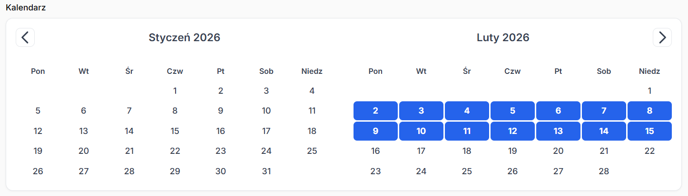

# Filament Calendar Component

A custom calendar component for FilamentPHP, supporting single date and date range selection.



## Installation

You can install the package via composer. Since this is a local package under development, add it to your `composer.json` repositories:

```json
"repositories": [
    {
        "type": "path",
        "url": "../path/to/calendar"
    }
]
```

Then require it:

```bash
composer require labapawel/calendar:@dev
```

## Configuration

Optionally, you can publish the views using:

```bash
php artisan vendor:publish --tag="calendar-views"
```

## Configuration & Usage

### Basic Usage

In your Filament Resource or Form:

```php
use LabaPawel\Calendar\Forms\Components\Calendar;

Calendar::make('appointment_date')
    ->label('Appointment Date')
```

### Date Range Selection

To enable picking a start and end date (which enables the "range" mode internally):

```php
Calendar::make('booking_period')
    ->range()
```

### Double View (Two Months)

For a better user experience when selecting ranges, you can show two consecutive months side-by-side. This layout automatically stacks on mobile devices.

```php
Calendar::make('booking_period')
    ->range()
    ->double() // Enables 2-month view
    ->columnSpanFull() // Recommended for double view
```

### Mapping Attributes (Direct Model Saving)

If you ignore the standard JSON storage and want to save directly to `start_date` and `end_date` columns on your model, use `startAttribute()` and `endAttribute()`.

**Note:** This works automatically for **both** creating and editing records. You do **not** need to add hidden fields or model mutators.

```php
Calendar::make('calendar_fields') // Name can be anything unique
    ->range()
    ->double()
    ->startAttribute('start_date') // Column for start date
    ->endAttribute('end_date')     // Column for end date
    ->columnSpanFull()
```

**Database Requirements:**
The columns (`start_date`, `end_date`) must be nullable or have default values if they are optional. The component saves dates in `YYYY-MM-DD` format.

## Localization

The package supports English and Polish. You can publish translations if needed (currently loaded automatically).

To customize translations, you can create files in `resources/lang/vendor/calendar/`.

## Styling

 The component uses an external CSS file for styling. If you don't see the styles applied (e.g., date selection color), ensure your assets are published or optimized.
 
 ```bash
 php artisan filament:assets
 php artisan optimize:clear
 ```
 
 You can customize the appearance by overriding the CSS variables in your global CSS or by modifying the published `resources/css/calendar.css` file.
 
 Available variables:
 - `--c-primary`: Main color (defaults to blue).
 - `--c-selected-bg`: Background color for selected dates.
 - `--c-bg`, `--c-text`, `--c-border`: Theme colors (light/dark mode supported).

## Troubleshooting

- **Missing styles?** Run `php artisan optimize:clear`.
- **Wrong date format?** Dates are stored as `Y-m-d` by default to ensure consistency with your database.
- **Missing text?** The component uses the browser's `Intl.DateTimeFormat` for day and month names, defaulting to Polish (`pl-PL`). Ensure your browser supports this API (all modern ones do).
